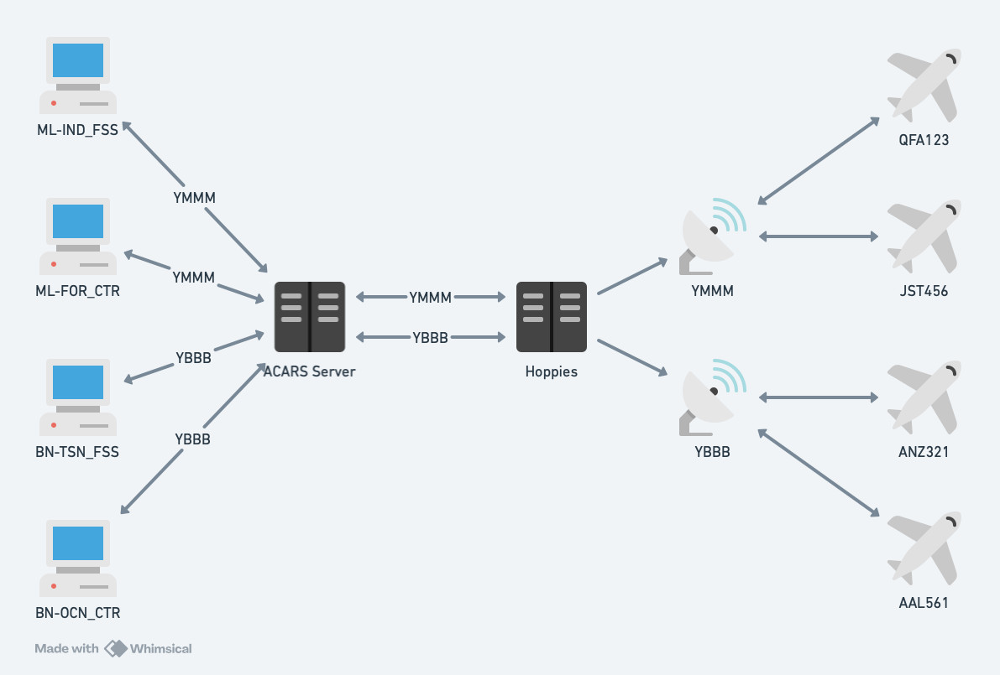

<h1 align="center">
  ACARS Server
</h1>

<h3 align="center">
  An ACARS connection aggregator for flight simulation

  [](https://github.com/YuKitsune/acarsserver/actions/workflows/build.yml)
  [](https://github.com/YuKitsune/ACARSServer/blob/main/LICENSE)
  [](https://github.com/YuKitsune/ACARSServer/releases)
</h3>

ACARS Server is a connection aggregator and message relay for ACARS simulation networks such as [Hoppies](https://www.hoppie.nl/acars/).

The server maintains connections to upstream ACARS networks. Each connection simulates a single air traffic service unit (ATSU), such as the Brisbane FIR (YBBB) or Melbourne FIR (YMMM). Messages from air traffic controllers are relayed to the upstream network, allowing pilots to connect to a single unit and communicate with all enroute controllers within that unit.

This solves a limitation in the Hoppies network where multiple controllers cannot share station IDs, preventing multiple controllers from operating under the same FIR identifier.



## Features

- CPDLC (Controller-Pilot Data Link Communications) message handling
- Telex message support
- Real-time message delivery for controller clients
- Multi-network support (VATSIM, IVAO)

## Requirements

- .NET 10.0 SDK (for local development)
- Docker (optional, for containerized deployment)

## Configuration

The server can be configured using environment variables.
Copy `example.env` to `.env` and update with your settings:

```bash
# Logging
Logging__Level=Information

# Database
ConnectionStrings__DefaultConnection=Data Source=acars.db

# ACARS Client Configuration
Acars__0__Type=Hoppie
Acars__0__FlightSimulationNetwork=VATSIM
Acars__0__StationIdentifier=YOUR_CALLSIGN
Acars__0__Url=http://www.hoppie.nl/acars/system/connect.html
Acars__0__AuthenticationCode=YOUR_HOPPIE_CODE
```

Multiple ACARS clients can be configured by incrementing the index (`Acars__1__`, `Acars__2__`, etc.).

`Hoppie` is currently the only supported ACARS network type.

## Running

### Docker

```bash
docker-compose up
```

The server will be available on ports 8080 (HTTP) and 8081 (HTTPS).

### Local Development

```bash
dotnet run --project source/ACARSServer/ACARSServer.csproj
```

The server will start on `http://localhost:5272`.

## Building

Use the Nuke build automation:

```bash
# Linux/macOS
./build.sh

# Windows (PowerShell)
./build.ps1

# Windows (CMD)
build.cmd
```

Or build directly with dotnet:

```bash
dotnet build source/ACARSServer.sln
```
